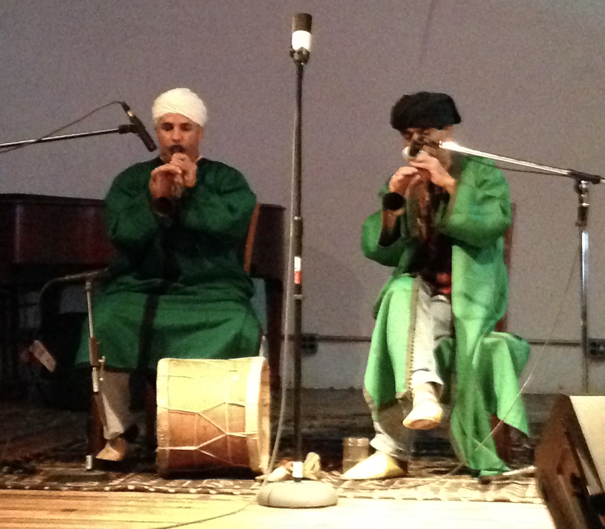

*The Master Musicians of Jahjouka, Morocco performing in Detroit, Michigan*

## Course Syllabus

[Click here for the course syllabus](/files/IslaminAmerica.pdf)

## Course Description

Muslims have been in the Americas since before the United States was founded. In recent decades they have faced a new wave of political alienation. Despite this societal backlash, Muslim communities in the United States of America have grown considerably, participating in all aspects American art, literature, politics, and media. From Ilhan Omer to Hasan Minhaj, Muslims have become visible in every part of American society. Out of this dynamism it is possible to ask: Is American Islam an extension of Global Islam or something uniquely American? In this class we will theorize this question through a variety of lenses including race relations, history, gender dynamics, class discrimination, assimilation, and immigration. Beginning with the Thomas Jefferson’s Qur’an and ending with Islamic hip hop, we will attempt to better understand the history of Islam in America through the multifarious and diverse voices of America’s Muslims. 

## Sample Readings

- Spellberg, *Thomas Jefferson’s Qur’an: Islam and the Founders*
- Austin, *African Muslims in Antebellum America* 
- Chan-Malik, *Being Muslim: A Cultural History of Women of Color in American Islam* 
- Khabeer, *Muslim Cool: Race, Religion, and Hip Hop in the United States* 
- Omar Ibn Said, *A Muslim American Slave: The Life of Omar Ibn Said* 
- Yuskaev, *Speaking Qurʼan: An American Scripture* 
- Curtis, *Muslim Americans in the Military: Centuries of Service*

